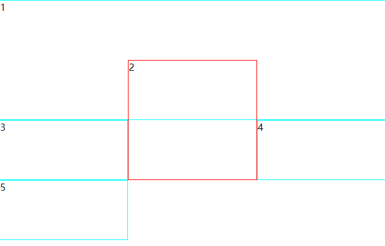
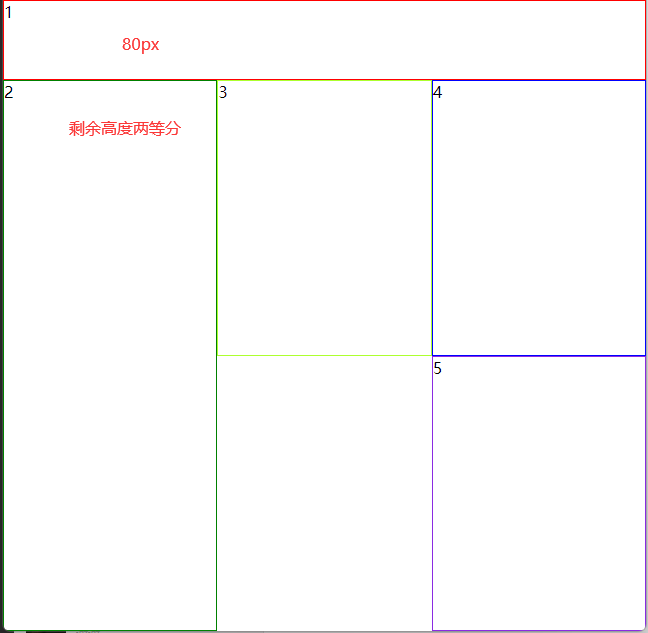

# property

## value

[repeat](https://developer.mozilla.org/zh-CN/docs/Web/CSS/repeat)

- auto-fill:
- auto-fit: 行为与 auto-fill 相同, 所有空的重复轨道都将折叠
- display: contents; 应用在子元素中,子元素成为网格元素并且应用自动定位规则放置在网格中
- span 关键字结合数字，表示跨越轨道的数量
- grid-auto-flow: dense(自动布局算法使用一种“稠密”堆积算法，如果后面出现了稍小的元素，则会试图去填充网格中前面留下的空白)

## code

```html
<style>
.main {
  display: grid;
  grid-template-columns: repeat(auto-fill, minmax(160px, 1fr));
}
/*  三列布局 */
.main {
  display: grid;
  grid-template-columns: repeat(3, 1fr);
  /* odd行高 100px， even行高 200px  */
  grid-auto-rows: 100px 200px;
}
.item {
  border: 1px solid cyan;
}
.one {
  /* 线编号定位元素， 默认延伸一个轨道 */
  grid-column-start: 1;
  grid-column-end: 4;
  grid-row-start: 1;
  grid-row-end: 3;
  z-index: 1;
}
.two {
  grid-column-start: 2;
  grid-row-start: 2;
  grid-row-end: 4;
  border: 1px solid red;
  z-index: 2;
}
/** 网格模板
  * . 表示留出的空白的网格单元 
  */
.main {
  height: 100%;
  display: grid;
  grid-template-columns: repeat(3, 1fr);
  grid-template-rows: 80px repeat(2, 1fr);
  grid-template-areas:
    "one one one"
    "two three four"
    "two . five"
}
.one {
  grid-area: one
}
.two {
  grid-area: two
}
.three {
  grid-area: three
}
.four {
  grid-area: four
}
.five {
  grid-area: five
}
</style>
<div class="main">
  <div class="item one">1</div>
  <div class="item two">2</div>
  <div class="item three">3</div>
  <div class="item four">4</div>
  <div class="item five">5</div>
</div>
```

## result

三列布局

网格布局

