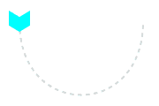
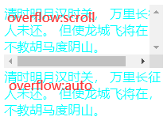
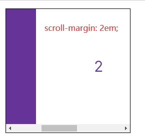

# property

`caret-color` 文本框插入符号颜色
`clip-path` 创建一个剪切区域
`mask-*` 遮罩
`object-*` 调整大小适应容器
`offset-*` 沿着定义的路径对元素进行动画处理
`shape-*` 

`overflow: hidden` 也可以通过 JavaScript Element.scrollTop 属性来滚动元素

`overscroll-behavior`: auto contain(不会触发滚动链) 对话框中有滚动内容，当对话框滚动到底部，对话框下面的也开始滚动(滚动链)
触及到底部或者顶部移动端浏览器倾向一种 '触底' 效果，甚至进行页面刷新

`*-block-[start|end]` block/inline 对应的水平还是垂直方向 取决于 writing-mode

## code

```html
<div class="box">
  <div class="offset-distance-result"></div>
</div>
```

```css
.box {
  display: flex;
  align-items: center;
  justify-content: center;
  height: 200px;
  text-align: center;
  background-position: calc(50% - 12px) calc(50% + 14px);
  background-image: url('data:image/svg+xml;utf8,<svg xmlns="http://www.w3.org/2000/svg" viewBox="-75 -45 150 140" width="150" height="140"><path d="M-70,-40 C-70,70 70,70 70,-40" fill="none" stroke="lightgrey" stroke-width="2" stroke-dasharray="4.5"/></svg>');
  background-repeat: no-repeat;
}
.offset-distance-result {
  width: 24px;
  height: 24px;
  background-color: aqua;
  offset-path: path('M-70,-40 C-70,70 70,70 70,-40');
  clip-path: polygon(0% 0%,70% 0%,100% 50%,70% 100%,0% 100%,30% 50%);
  offset-distance: 0;
  transition: all .3s ease-in;
}
.box:hover .offset-distance-result {
  offset-distance: 80%;
}
```

## result




