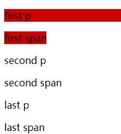

# Pseudo

## Element

- after / before
- selection
- placeholder
- marker
- first-line
- first-letter
- file-selector-button 针对 type="file" 的 input 元素
- backdrop 紧挨着顶层呈现的任何元素的下方呈现

## Class

- active 鼠标按下状态
- any-link
- autofill
- checked
- current
- default 设定默认值的元素
- dir([ltr | rtl])
- enabled/disabled  设置 disabled 元素样式
- empty
- first/last-child 同级元素中的第一个元素
- first/last-of-type
- nth-child(-n+3) 前三， even 偶数， odd
- nth-last-of-child()
- only-child 等价于 :first-child:last-child
- only-of-type
- focus(select 影响 option) / focus-visible(select 不设置option) / focus-within
- fullscreen
- has()
- hover
- in-range 范围值在 min 和 max 之间(时间同样可以设置)
- out-of-range
- indeterminate 半选状态
- invalid/valid 表单验证样式
- is()
- lang()
- link 有 href 属性的元素
- modal
- muted
- not()
- optional 针对无 required 属性的 input select textarea 元素设置
- paused
- picture-in-picture
- placeholder-shown
- playing
- read-only 不可编辑的元素
- read-write
- required
- root 定义全局变量及属性
- seeking
- stalled 停止播放
- target URL fragment 匹配的 id 元素

## code

```html
<div class="box">
  <p>first p</p>
  <span> first span </span>
  <p>second p</p>
  <span>second span </span>
  <p>last p</p>
  <span>last span</span>
</div>
```

```css
.box :nth-child(-n+2) {
  background-color: #cd0000;
}
```

## result


