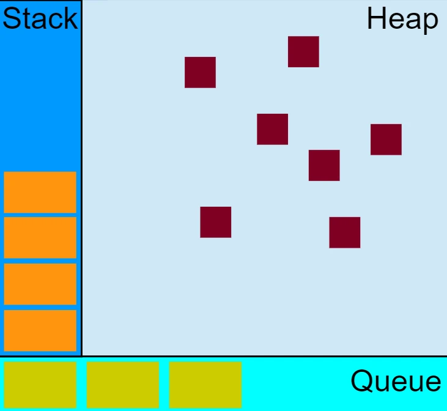

# document

## deep clone

一个 JavaScript 对象可以被`序列化`(将一个对象或数据结构转换为适合网络传输或存储的格式（如数组缓冲区或文件格式）的过程)，则存在一种创建深拷贝的方式：JSON.stringify(), JSON.parse()

许多JavaScript 对象根本不能序列化。例如，函数（带有闭包）、Symbol、在 [HTML DOM API](https://developer.mozilla.org/zh-CN/docs/Web/API/HTML_DOM_API) 中表示 HTML 元素的对象、递归数据以及许多其他情况。在这些条件下调用 JSON.stringify() 来序列化会失效。

```js
/**
 * 浅拷贝
 * 内置复制对象
 * ...、Array.prototype.concat()、Array.prototype.slice()、Array.from()、Object.assign() 和 Object.create()
 */
const list = ['JavaScript', { name: 'JavaScript' }];
const list_copy = Array.from(list);
list_copy[1].name = 'JavaScript_Clone';
/**
 * ["JavaScript",{"name":"JavaScript_Clone"}]
 */
console.log(JSON.stringify(list));

/* Symbol */
const s = Symbol('JavaScript');
const list = ['JavaScript', { [s]: 'Javascript'  }];
const list_copy = Array.from(list);
list_copy[1][s] = 'JavaScript_Clone';
/**
 * ["JavaScript",{}]
 */
console.log(JSON.stringify(list));

```

## Array

```js
/**
 * 可迭代的或是类数组对象创建一个浅拷贝的数组实例
 */
Array.from()
Array.fromAsync() // 类似 for await ... of
Array.isArray()
/**
 * accumulator: 上一次调用 callbackFn 的结果。在第一次调用时，如果指定了 initialValue 则为指定的值，否则为 array[0] 的值。
 * currentValue: 当前元素的值。在第一次调用时，如果指定了 initialValue，则为 array[0] 的值，否则为 array[1]。
 */
Array.property.reduce((accumulator, currentValue,currentIndex, array) =>{}, initialValue)
Array.property.toLocalString()
/**
 * 返回新的数组，不影响原数组
 */
Array.property.toReversed()
Array.property.toSorted()
Array.property.toSpliced()
Array.property.with(index, value)
```

## Atomics

提供一组静态方法对 SharedArrayBuffer 和 ArrayBuffer 对象进行原子操作

## DateView

可以从二进制 ArrayBuffer 对象读取多种数值类型的底层接口(使用它时`不需要考虑不同平台字节序`问题)

```js
const buffer = new ArrayBuffer(16); // Create an ArrayBuffer with a size in bytes
const view = new DateView(buffer);
/**
 * view.setInt16(byteOffset, value [, littleEndian])
 * byteOffset 偏移量，单位字节
 * littleEndian true 小端
 */
view.setInt16(0,32767); // Max signed 16-bit integer
console.log(view.getInt16(0)); // 32767

Number.isInteger(1.0) // true
```

## globalThis

包含全局的 this 值

## Math

```js
// 去除数字的小数部分，只保留整数部分
Math.trunc(1.4) // 1
```

## Object

```js
const obj = { name: 'JavaScript' }

Object.hasOwn(obj, 'name')
obj.hasOwnProperty('name')

Object.is(obj, obj)// true

/**
 * 防止扩展对象，并使现有的属性不可写入和不可配置
 */
Object.freeze()
Object.isFrozen()

/**
 * 防止新属性被添加到对象中（即防止该对象被扩展）
 */
Object.preventExtensions()
Object.isExtensible()

/**
 * 密封一个对象会阻止其扩展并且使得现有属性不可配置
 * 只要现有属性的值是可写的，它们仍然可以更改
 */
Object.seal()

Object.prototype.toString.call([]).slice(8, -1)
```

`Object.getOwnPropertyDescriptor()` 获取对象中属性的描述信息

1. `for...in` 遍历对象自身和继承的可枚举属性
2. `Object.keys()` 遍历对象自身的所有可枚举的属性的键名
3. `JSON.stringfy()` 串行化对象自身可枚举的属性
4. `Object.assign()` 只拷贝对象自身可枚举的属性
5. `Object.getOwnPropertyNames()` 返回对象自身所有属性(不含Symbol)
6. `Object.getOwnPropertySymbols()` 返回对象自身所有Symbol属性
7. `Reflect.ownKeys()` 包含自身的所有键名
8. `Object.getOwnPropertyDescriptors` 获取对象的所以自身属性的描述符

## Promise

```js
/**
 * 当所有输入的 Promise 都被 fulfilled，并返回一个包含所有 fulfilled 的数组。如果输入的任何 Promise 被 rejected，并带有第一个 rejected 的原因。
 */
Promise.all()
/**
 * 当所有输入的 Promise 都结束，返回带有描述每个 Promise 结果的对象数组。
 */
Promise.allSettled()
/**
 * 当输入的任何一个 Promise fulfilled，并返回第一个兑现的值。当所有输入 Promise 都被 rejected（包括传递了空的可迭代对象）时，它会以一个包含 rejected 原因数组的 AggregateError。
 */
Promise.any()
/**
 * 返回第一个完成状态的 promise
 */
Promise.race()
```

## Reflect

内置对象，它提供拦截 JavaScript 操作的方法。

## String

JavaScript 内部字符都是 UTF-16 的格式存储，每个字符固定 2 个字节。

Unicode 字符集比 65535 大得多，额外的字符用代理对(一对 16 bit码元，高位代理 0xD800-0xDBFF,低位代理0xDC00-0xDFFF。这些码元不用于编码单码元字符)存储在 UTF-16 中

Unicode 码位范围 0 - 0x10FFFF

```js
/**
 * 返回由指定的 UTF-16 码元序列创建的字符串(仅适用于 16 位的值)
 * 
 * numN 介于 0 - 65535 之间的数字，表示一个 UTF-16 码元
 * 大于 0xFFFF 的数字被截断为最后的 16 bit
 * 
 * Unicode 范围 0 - 0x10FFFF(与 \u 转义序列相同),
 */
String.fromCharCode(numN)
/**
 * 给定索引处的 UTF-16 码元，其值介于 0 和 65535 之间。
 */
String.property.charCodeAt(index)

/**
 * 根据指定的码位序列返回一个字符串
 * 
 * numN 一个介于 0 和 0x10FFFF（包括两者）之间的整数，表示一个 Unicode 码位
 */
String.fromCodePoint(numN)
/**
 * 从给定索引(基于 UTF-16 码元)开始的字符的 Unicode 码位值
 */
String.property.codePointAt(index)
```

`String.prototype.match/replace/search/split` 调用 `RegExp.prototype[Symbol.match/replace/search/split]`

## Symbol

```js
/**
 * 从运行时的 symbol 注册表中找到对应的 symbol，如果找到了，则返回它，否则，新建一个与该键关联的 symbol，并放入全局 symbol 注册表中。
 */
Symbol.for(key)
```

## 继承

寄生组合式继承

```js
function inheritPrototype(subType, supType) {
  let prototype = Object.create(supType.prototype)
  prototype.constructor = subType
  subType.prototype = prototype
}
function SupType(name) {
  this.name = name
  this.color = ['red', 'blue']
}
SupType.prototype.sayName = function() {
  console.log(this.name)
}
function SubType(name, age) {
  // 继承SupType并传参
  SupType.call(this, name)
  this.age = age
}
inheritPrototype(SubType, SupType)
```

## 模块

```js
//a.js
export default {
  name: 'JavaScript'
}
export const Id = '1'
//b.js

```

## 优化

函数尾调用

内存泄漏

```js
function assignHandler() {
  let ele= document.getElementById('id')
  let id = ele.id
  // 闭包：绑定在外部元素上的事件（依赖）
  ele.onclick = () => console.log(id)
  ele = null
}
```

## this

作为一个 DOM 事件处理函数, this 总是指向触发事件的元素 `this === e.currentTarget`

## 动画

requestAnimationFrame(callback)

- 大多数浏览器里，当requestAnimationFrame() 运行在后台标签页或者隐藏的 iframe标签里时，requestAnimationFrame() 会被暂停调用以提升性能和电池寿命

SetTimeout
在浏览器中，setTimeout()/setInterval() 的每调用一次定时器的最小间隔是 4ms，这通常是由于函数嵌套导致（嵌套层级达到一定深度），或者是由于已经执行的 setInterval 的回调函数阻塞导致的
如果想在浏览器中实现 0ms 延时的定时器，你可以参考 window.postMessage()
未被激活的 tabs 的定时最小延迟>=1000ms

## 正则表达式

```js
function parseLog(entry) {
  const { author, timestamp } = /^(?<timestamp>\d+),(?<author>.+)$/.exec(
    entry,
  ).groups;
  return `${author} committed on ${new Date(
    parseInt(timestamp) * 1000,
  ).toLocaleString()}`;
}

parseLog("1560979912,Caroline") // 'Caroline committed on 6/20/2019, 5:31:52 AM'
```

## 计时

performance

## Web Cryptography API

- Crypto.getRandomValues(typedArray): 获取符合密码学要求的安全的随机值。传入参数的数组被随机值填充（在加密意义上的随机）。是一个基于整数的 TypedArray，它可以是 Int8Array、Uint8Array、Int16Array、 Uint16Array、 Int32Array 或者 Uint32Array。在数组中的所有的元素会被随机数重写。
SubtleCrypto
- Crypto.subtle 只读
  - 生成密码学摘要
  支持4种摘要算法SHA-1(类似MD5,不安全)和3种SHA-2(SHA-256,SHA-384,SHA-512三种)
  - digest(algorithm, data)：生成消息摘要
  - encrpty(algorithm, key, data): RSA-OAEP/AES-CTR/AES-CBC/AES-GCM
  - decrpty(algorithm, key, data)

## 调用堆栈、消息队列


如果执行栈里的任务执行完成,即执行栈为空的时候（即JS引擎线程空闲）,事件触发线程才会从消息队列取出一个任务（即异步的回调函数）放入执行栈中执行。执行完了后,再次执行栈, 等执行栈为空,事件触发线程会重复上一步操作,再取出一个消息队列中的任务,这种机制就被称为事件循环（event loop）机制。

## 参考

`?.` 引用为空(nullish)(null 或 undefined)
`??` 左侧 nullish，返回右侧的操作数，否者返回左侧的操作数

```js
for await (v of iterable) { }
```

`for-in`循环和`Object.keys()`的枚举顺序是不确定的，取决于JavaScript引擎，可能因浏览器而异。

Apache Beach (ab) apache 自带的压力测试工具

```shell
# c 并发数 t 测试进行的最大秒数
ab -c 100 -t 100 -H "Cookie: key1=value1;key2=value2" 100 http://127.0.0.1:8080
```

## 网络服务和安全

TLS/SSL 是一个公钥私钥的结构，非对称的结构，Node 底层是通过 openssl 实现的
通过引入数字证书(包含服务器的名称，主机名，公钥，签名颁发机构相关的信息)来进行认证，防止中间人的攻击(对客户端扮演服务端，对服务端扮演客户端的操作)

```shell
# 生成私钥
openssl genrsa -out server.key 1024
# 根据私钥生成公钥
openssl rsa -in server.key -pubout -out server.pem
```

数字证书 Certificate Authority: 为站点颁发证书，这个证书具有 CA 通过自己公钥私钥实现的签名
服务端先根据私钥生成 csr (Certificate Signing Request) 文件,然后生成自签名证书(扮演 CA 角色需要的文件)

```shell
openssl genrsa -out ca.key 1024
openssl req -new -key ca.key -out ca.csr
openssl x509-req -in ca.csr -signkey ca.key -out ca.crt

# 服务器端需要向 CA 机构申请签名证书
openssl genrsa -out server.key 1024
openssl req -new -key server.key -out server.csr
openssl x509-req -CA ca.crt -CAkey ca.key -CAcreateserial -in server.csr -out server.crt
```

客户端在发起请求前先去服务端获取证书，并通过 CA 的证书校验服务端证书的真伪。知名的证书一般会预装在浏览器中，如果是自己扮演 CA 机构则，客户端需要先获取到 CA 证书才能校验。

## 库

[bigpipe](https://github.com/bigpipe/bigpipe) 通过一个队列控制并发量
[iconv-lite](https://github.com/ashtuchkin/iconv-lite) 转换成不同的编码格式
[LRU 算法的缓存](https://github.com/isaacs/node-lru-cache)
[Async](https://caolan.github.io/async/v3/) 流程控制模块，处理异步的各种协作模式
[Step](https://github.com/creationix/step)
[path-to-regexp](https://github.com/pillarjs/path-to-regexp)
[dotenv](https://github.com/motdotla/dotenv) 从 `.env` 文件加载环境变量到 `process.env`
[shortcuts](https://github.com/fabiospampinato/shortcuts)

## 文档

[Fetch Standard](https://fetch.spec.whatwg.org/)
