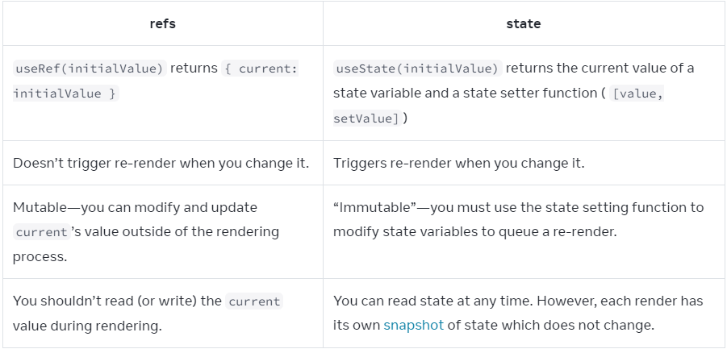

# document

## Using Hooks

Functions starting with `use` are called Hooks.
Hooks can only be called at the top level of the component function.

## DOM Event

```ts
export default function Form() {
  const [value, setValue] = useState('');
  
  function handleChange(event: React.ChangeEvent<HTMLInputElement>) {
    setValue(event.currentTarget.value)
  }

  return (
    <>
      <input value={value} onChange={handleChange} />
    </>
  )
}
```

## Children

```ts
/**
 * React.ReactNode type union all the possible types passed as children in JSX
 * React.ReactElement only JSX elements
 */
interface RenderModal {
  title: string;
  children: React.ReactNode;
}
```

## Style Props

```ts
/**
 * React.CSSProperties union of all the possible CSS properties
 */
interface ComponentProps {
  style: React.CSSProperties;
}
```

## Import / Export

|Syntax|Export statement|Import statement|
|----|----|----|
|Default|export default function Button() {}|import Button from './Button.js';|
|Named|export function Button() {}|import { Button } from './Button.js';|

## JSX

1. Return a single root element
2. Close all the tags
3. camelCase most of the things! eg. React `className` instead `class`

    - [DOM props](https://react.dev/reference/react-dom/components/common)

4. dynamically value replace `""` with curly braces `{}` (also bring JavaScript logic)
5. condition operate `? :`
6. logical operator `&&`
7. rendering list use `filter()` `map()`
8. `key={Math.random()}` leading to components，DOM being recreated every time
9. keeping components pure. `must always return the same JSX given the same inputs.`
10. side effects. happen “on the side”, not during rendering.

## adding interactivity

```ts
// scheduled using a snapshot of the state at the time the user interacted with it!
export default function Button({children}) {
  const [number, setNumber] = useState(0);
  
  // 传递参数时, onClick 用回调函数 () => handleClick(parameter)
  // 直接绑定 handleClick(parameter) 渲染时触发函数回调，会导致无限循环
  function handleClick() {}
  return(
    <div>
      <input onChange={event => {
        event.stopPropagation(); // preventDefault
      }} />
      <button
        onClick={handleClick}
      >
        {children}
      </button>
      </div>
  )
}
```

1. state is isolated and private
2. render initial render and state has been updated.
3. snapshot: the state at the time the user interacted with it

    React keeps the state values “fixed” within one render’s event handlers.

4. updating the same state multiple times before the next render

    updater function

    ```js
    setNumber(number + 5);
    setNumber(n => n + 1);
    setNumber(42);
    /**
     * next render: state queue first return 5, then 5 + 1, then 42(final result)
     */
    ```

5. updating object / arrays in state

    ```ts
    const [position, setPosition] = useState({
      x: 0,
      y: 0,
      web: {
        front: 'javascript'
      }
    });

    setPosition({
      ...position, // copy the old fields
      x: e.clientX, // override 
      y: e.clientY
    });

    /**
     * updating nested object
     * Or https://github.com/immerjs/use-immer
     * const nextWeb = { ...position.web, front: 'React' }
     * const nextPosition = { ...position, web: nextWeb }
     * setPosition(nextPosition)
     */ 

    /**
     * updating arrays 
     * avoid (mutates the array)                    prefer (returns a new array)
     * adding push, unshift concat,                 [...arr] spread syntax
     * removing pop, shift, splice                  filter, slice (浅拷贝)
     * replacing  splice, arr[i] = ... assignment   map
     * sorting  reverse, sort                       copy the array first
     * 
     * 
     */
    function add(arr, value) {
      return [
        ...arr,
        value
      ]
    }

    function replace(arr, index, value) {
      return [...arr.slice(0, index), value, ...arr.slice(index + 1)]
    }

    function remove(arr, index) {
      return [...arr.slice(0, index), ...arr.slice(index + 1)]
    }
    ```

## managing state

1. reacting input with state

    ```ts
    const [firstName, setFirstName] = useState('');
    const [lastName, setLastName] = useState('');
    // useState trigger a re-render
    const fullName = `${firstName} ${lastName}`; // calculating fullName
    ```

2. avoid duplication in state(the same object at different state)
3. avoid deeply nested state(consider making it flat)
4. passing a different `key` to be re-created, resets all state
  
    - Same component at the same position preserves state

## refs

记录一些信息但是不触发新的渲染

```js
const num = useRef(0) // return { current: 0 }
```

1. storing timeout IDs
2. storing manipulating DOM elements, which we cover on the next page
3. storing other objects that aren’t necessary to calculate the JSX
4. 创建自己定义组件上的 ref
   1. `forwardRef((props, ref) => { return <input {...props} ref={ref} /> })`


## effect

props 或 state 改变更新组件状态时，不需要使用 effect

- You don’t need Effects to transform data for rendering
- You don’t need Effects to handle user events

effects run after every render.

```ts
// useEffectEvent
// requestAnimationFrame
useEffect(() => {
  // This runs after every render
  // 禁止内部改变状态（会导致无限循环）
});

useEffect(() => {
  // This runs only on mount
}, []);

useEffect(() => {
  // 开发模式下 React 故意 remount, 是为了提示别忘记实现 cleanup function

  // This runs on mount *and also* if either a or b have changed since the last render
 
  return () => {
    // Effect runs next time 之前 and Unmount 时触发
    // 实现 cleanup function 修复 remount
}, [a, b]);

// 相关事件处理, 防止事件依赖 state/props 更改整个 effect 重新触发渲染
useEffectEvent(() => {

})
```
